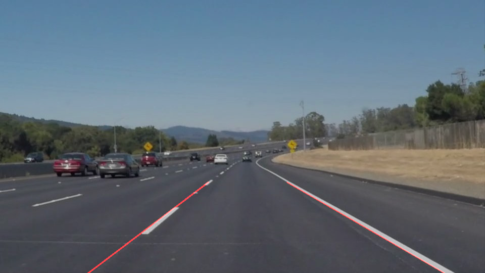

# **Finding Lane Lines on the Road** 

## Writeup Template

### You can use this file as a template for your writeup if you want to submit it as a markdown file. But feel free to use some other method and submit a pdf if you prefer.

---

**Finding Lane Lines on the Road**

The goals / steps of this project are the following:
* Make a pipeline that finds lane lines on the road
* Reflect on your work in a written report

---

### Reflection

### 1. Describe your pipeline. As part of the description, explain how you modified the draw_lines() function.

My pipeline consisted of 5 steps. 
- converted the images to grayscale
- blur the image to erase some unnecessary detail of the image
- fetch the points of interest since the lane lines will only appear in the buttom-center of an image.
- using hough line detection to fetch the fetch the lines in eadge graph.
- stack the extracted line onto original image.

In order to draw a single line on the left and right lanes, I modified the draw_lines() function by 
- Seperate the lines into 2 groups, positive slope and negitive slope.
- Calculate the slope and bias for each group, ignore those lines which absolute value of each slope not in (0.3, 10/3)
- Calculate median of lines in each group.

### 2. Identify potential shortcomings with your current pipeline

One potential shortcoming would be the lane line detection is not very stable in a video.

Another shortcoming could be this pipeline is easy to be affected by noises(light, tree, cars, etc)

### 3. Suggest possible improvements to your pipeline

A possible improvement would be to introduce a momentum to the lane line among adjacent frames to prevent it from sudden movement. 

Another potential improvement could be to fine tune the parameter of canny edge detection, hough transformation to further rule out noises based on more data, diffent road, different light condition, etc.
